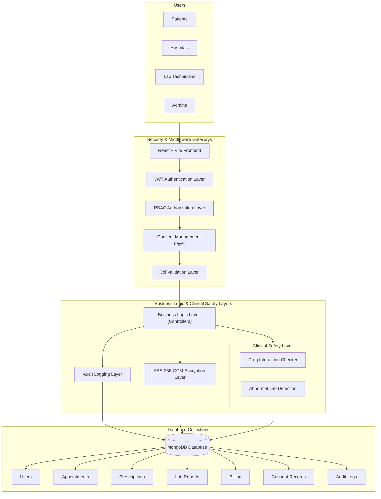

# MedVault - Healthcare Appointment & Management Platform

MedVault is a comprehensive Healthcare Appointment & Management platform built using the MERN stack. It features Multi-Role Access Control, Consent-Based Data Sharing, Audit Logging, a unified Medical Timeline, and Clinical Safety Features with Security & Compliance-Inspired Controls. The platform provides a seamless, secure interface for Patients, Hospitals, Lab Technicians, and Administrators to manage healthcare operations efficiently.

## Architecture Diagram



## Key Features

- **Multi-Role Authentication:** Dedicated portals for Patients, Hospitals, Lab Technicians, and Admins.
- **Appointment Management:** Patients can book appointments, and hospitals can update their status.
- **Digital Prescriptions:** Hospitals can generate and update prescriptions for patients.
- **Lab Report Integration:** Lab technicians can upload reports directly to patient profiles.
- **Billing System:** Automated billing and history tracking.
- **Security:** Secure password hashing and JWT-based authentication.
- **Profile Management:** Users can update their personal information and profiles.

### Security & Compliance
- **JWT Authentication Enforcement:** Secures API routes and validates user sessions.
- **Role-Based Access Control (RBAC):** Restricts system resources based on user roles.
- **Server-Side Authorization:** Enforces strict permission validation on the server.
- **IDOR/BOLA Protection:** Prevents unauthorized cross-user record access.
- **Login Rate Limiting:** Mitigates brute-force attacks.
- **Joi Request Validation:** Sanitizes and validates client inputs.
- **AES-256-GCM Field-Level Encryption:** Secures sensitive patient data at rest.
- **Audit Logging:** Records database modifications and authorization events.
- **Consent Management:** Handles consent workflows for medical records.
- **Consent Grant/Revoke Workflow:** Allows patients to delegate or rescind access to their data.

### Healthcare Enhancements
- **Unified Medical Timeline:** Chronological view of patient encounters, prescriptions, and lab tests.
- **Cross-Hospital Medical History Access:** Enables shared care records across clinical boundaries.
- **Drug Interaction Checker:** Screens prescriptions for unsafe drug combinations.
- **Abnormal Lab Value Detection:** Highlights critical or out-of-range lab results.
- **Consent-Based Record Sharing:** Ensures record access is backed by explicit patient authorization.

### Admin Features
- **Audit Log Dashboard:** Real-time visibility into system events and transactions.
- **Security Monitoring:** Tracks potential threats and validation failures.
- **Access Tracking:** Monitors login events and permission usage.

## Technology Stack

- **Frontend:** React.js, Vite, Bootstrap, CSS3, Owl Carousel, Font Awesome
- **Backend:** Node.js, Express.js
- **Database:** MongoDB (Mongoose)
- **Authentication:** JWT (JSON Web Tokens) & Bcrypt (Password Hashing)
- **File Handling:** Multer (for Lab Report uploads)
- **Security & Validation:** Joi, Express Rate Limit, Node Crypto (AES-256-GCM)
- **Other Tools:** Axios, React Cookie

## Environment Variables

### Backend Environment Variables
* `CONNECTION_STRING`: MongoDB connection URI.
* `JWT_SECRET`: Secret key used for signing JWT tokens.
* `ENCRYPTION_KEY`: 32-byte hex key for AES-256-GCM field-level encryption.
* `API_URL`: Base route for the backend APIs.
* `PORT`: Server listening port.

### Frontend Environment Variables
* `VITE_API_URL`: Absolute URL of the backend API server.

## How to Run Locally

### 1. Prerequisites
- Install [Node.js](https://nodejs.org/)
- Install [MongoDB](https://www.mongodb.com/try/download/community)

### 2. Setup the Backend
Navigate to the **Backend** folder and install dependencies:
```bash
cd Backend
npm install
```
Create a `.env` file in the **Backend** folder:
```env
CONNECTION_STRING = mongodb://localhost:27017/Your_DB_Name
JWT_SECRET = your_secret_key
ENCRYPTION_KEY = your_32_byte_hex_encryption_key
API_URL = /api/v1
PORT = 4000
```
Start the server:
```bash
npm start
```

**Seed the Database (Admin Credentials):**
Before starting the server for the first time, run the seed script to create the default Admin account:
```bash
npm run seed
```
> **Default Admin Credentials:**
> - **Email:** `admin@gmail.com`
> - **Password:** `admin#2387`

> **Note:** Make sure to manually create a folder named `uploads` inside `Backend/public/` to store patient lab reports.

### 3. Setup the Frontend
Open a new terminal, navigate to the **Frontend** folder:
```bash
cd Frontend
npm install
```
Create a `.env` file in the **Frontend** folder:
```env
VITE_API_URL = http://localhost:4000
```
Start the development server:
```bash
npm run dev
```
The app will be available at `http://localhost:5173/`.

---
*MedVault - Modern Healthcare Solution*

