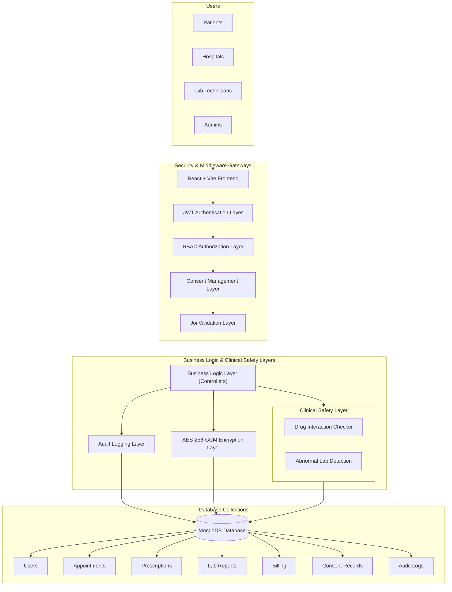

# MedVault - Healthcare Appointment & Management Platform

MedVault is a comprehensive Healthcare Appointment & Management platform built using the MERN stack. It features Multi-Role Access Control, Consent-Based Data Sharing, Audit Logging, a unified Medical Timeline, and Clinical Safety Features with Security & Compliance-Inspired Controls. The platform provides a seamless, secure interface for Patients, Hospitals, Lab Technicians, and Administrators to manage healthcare operations efficiently.

## Architecture Diagram



## Key Features

- **Multi-Role Authentication:** Dedicated portals for Patients, Hospitals, Lab Technicians, and Admins.
- **Appointment Management:** Patients can book appointments, and hospitals can update their status.
- **Digital Prescriptions:** Hospitals can generate and update prescriptions for patients.
- **Lab Report Integration:** Lab technicians can upload reports directly to patient profiles.
- **Billing System:** Automated billing and history tracking.
- **Security:** Secure password hashing and JWT-based authentication.
- **Profile Management:** Users can update their personal information and profiles.

### Security & Compliance
- **JWT Authentication Enforcement:** Secures API routes and validates user sessions.
- **Role-Based Access Control (RBAC):** Restricts system resources based on user roles.
- **Server-Side Authorization:** Enforces strict permission validation on the server.
- **IDOR/BOLA Protection:** Prevents unauthorized cross-user record access.
- **Login Rate Limiting:** Mitigates brute-force attacks.
- **Joi Request Validation:** Sanitizes and validates client inputs.
- **AES-256-GCM Field-Level Encryption:** Secures sensitive patient data at rest.
- **Audit Logging:** Records database modifications and authorization events.
- **Consent Management:** Handles consent workflows for medical records.
- **Consent Grant/Revoke Workflow:** Allows patients to delegate or rescind access to their data.

### Healthcare Enhancements
- **Unified Medical Timeline:** Chronological view of patient encounters, prescriptions, and lab tests.
- **Cross-Hospital Medical History Access:** Enables shared care records across clinical boundaries.
- **Drug Interaction Checker:** Screens prescriptions for unsafe drug combinations.
- **Abnormal Lab Value Detection:** Highlights critical or out-of-range lab results.
- **Consent-Based Record Sharing:** Ensures record access is backed by explicit patient authorization.

### Admin Features
- **Audit Log Dashboard:** Real-time visibility into system events and transactions.
- **Security Monitoring:** Tracks potential threats and validation failures.
- **Access Tracking:** Monitors login events and permission usage.

## Technology Stack

- **Frontend:** React.js, Vite, Bootstrap, CSS3, Owl Carousel, Font Awesome
- **Backend:** Node.js, Express.js
- **Database:** MongoDB (Mongoose)
- **Authentication:** JWT (JSON Web Tokens) & Bcrypt (Password Hashing)
- **File Handling:** Multer (for Lab Report uploads)
- **Security & Validation:** Joi, Express Rate Limit, Node Crypto (AES-256-GCM)
- **Other Tools:** Axios, React Cookie

## Project Structure

```text
MedVault/
├── Backend/                                          # Server-side backend environment
│   ├── app.js                                        # Main server file and Express application entry point
│   ├── helpers/                                      # Utility helper and middleware functions
│   │   ├── auditLogger.js                            # Helper functions for logging security-relevant actions to audit log database
│   │   ├── drugChecker.js                            # Helper function for verifying compatibility of drug combinations
│   │   ├── jwt.js                                    # JWT validation and creation middleware
│   │   └── validation.js                             # Helper validation logic for requests and data input
│   ├── models/                                       # Mongoose database models and schemas
│   │   ├── appointment.js                            # Mongoose schema and model for patient appointments
│   │   ├── auditLog.js                               # Mongoose schema and model for audit log entries
│   │   ├── billing.js                                # Mongoose schema and model for bills and billing history
│   │   ├── consent.js                                # Mongoose schema and model for patient consent records
│   │   ├── feedback.js                               # Mongoose schema and model for patient/hospital feedback
│   │   ├── hospital.js                               # Mongoose schema and model for hospital user profiles
│   │   ├── labtest.js                                # Mongoose schema and model for laboratory test records and reports
│   │   ├── prescription.js                           # Mongoose schema and model for prescriptions issued by doctors
│   │   └── user.js                                   # Mongoose schema and model for unified system users
│   ├── package-lock.json                             # Locked dependency tree for Node backend
│   ├── package.json                                  # Dependencies, scripts, and package metadata for backend
│   ├── routes/                                       # Express API route handlers
│   │   ├── appointment.js                            # API routes and controller functions for appointment management
│   │   ├── billing.js                                # API routes and controller functions for billing and payments
│   │   ├── consent.js                                # API routes and controller functions for data access consent
│   │   ├── feedback.js                               # API routes and controller functions for system feedback
│   │   ├── hospital.js                               # API routes and controller functions for hospital operations
│   │   ├── labtest.js                                # API routes and controller functions for laboratory report management
│   │   ├── prescription.js                           # API routes and controller functions for digital prescriptions
│   │   └── users.js                                  # API routes and controller functions for user authentications and profiles
│   ├── seedAdmin.js                                  # Script to pre-populate/seed initial system administrator credentials
│   └── utils/                                        # Security and clinical calculation utilities
│       ├── encryption.js                             # Field-level AES-256-GCM encryption/decryption utilities for sensitive data
│       └── slotGenerator.js                          # Utility to generate booking time slots for hospitals
├── Frontend/                                         # Frontend application directory
│   ├── .eslintrc.cjs                                 # ESLint configuration rules for React code quality
│   ├── index.html                                    # Entry HTML file served by Vite for the React client app
│   ├── package-lock.json                             # Locked dependency tree for React frontend
│   ├── package.json                                  # Dependencies, scripts, and package metadata for frontend
│   ├── public/                                       # Public static directory containing web assets
│   │   └── React-icon.png                            # React logo icon asset
│   └── src/                                          # Frontend source files
│       ├── App.jsx                                   # Main React application component containing app-wide routes
│       ├── components/                               # React view and UI components
│       │   ├── AdminHome.jsx                         # Home dashboard view for administrator role
│       │   ├── AdminLogin.jsx                        # Admin-specific login page component
│       │   ├── AdminProfile.jsx                      # Detailed profile view for administrators
│       │   ├── ChangePassword.jsx                    # Settings component for account password changes
│       │   ├── ConsentSettings.jsx                   # Settings component for managing/editing patient consents
│       │   ├── EditAdminProfile.jsx                  # Edit form component for admin profiles
│       │   ├── EditHospitalProfile.jsx               # Edit form component for hospital profiles
│       │   ├── EditPatientProfile.jsx                # Edit form component for patient profiles
│       │   ├── HospitalHome.jsx                      # Home dashboard view for hospital accounts
│       │   ├── HospitalProfile.jsx                   # Detailed profile view for hospitals
│       │   ├── HospitalRegister.jsx                  # Public registration page for hospital roles
│       │   ├── Index.jsx                             # MedVault public home/landing page
│       │   ├── LabHome.jsx                           # Home dashboard view for lab technician accounts
│       │   ├── LabLogin.jsx                          # Lab tech specific login page component
│       │   ├── LabProfile.jsx                        # Detailed profile view for lab technicians
│       │   ├── Logout.jsx                            # Session logout logic component
│       │   ├── MoreInfo.jsx                          # Info card component for hospital profiles
│       │   ├── MoreInfoPatient.jsx                   # Detailed clinical overview modal/view for patient profiles
│       │   ├── PatientHome.jsx                       # Home dashboard view for patient accounts
│       │   ├── PatientProfile.jsx                    # Detailed profile view for patients
│       │   ├── PatientRegister.jsx                   # Public registration page for patients
│       │   ├── PostAppointment.jsx                   # Form to request/post a new appointment
│       │   ├── PostBilling.jsx                       # Form to post a new billing/invoice transaction
│       │   ├── PostFeedback.jsx                      # Form to submit patient feedback
│       │   ├── PostHospital.jsx                      # Form to submit hospital profiles
│       │   ├── PostLabReg.jsx                        # Form to register a lab technician account
│       │   ├── PostLabtest.jsx                       # Form to upload a new laboratory test record
│       │   ├── PostPrescription.jsx                  # Form to write and post a patient prescription
│       │   ├── ResetPassword.jsx                     # Component for password reset forms
│       │   ├── Title.jsx                             # Title bar/header layout component
│       │   ├── UpdateBilling.jsx                     # Form to edit/update billing information
│       │   ├── UpdateHospital.jsx                    # Form to edit/update hospital information
│       │   ├── UpdateLabuser.jsx                     # Form to edit/update lab user credentials
│       │   ├── UpdatePrescription.jsx                # Form to update/modify an existing prescription
│       │   ├── UpdateStatusAdmin.jsx                 # Component for admins to toggle status of hospitals/users
│       │   ├── UpdateStatusAppointment.jsx           # Component for hospitals to toggle/update appointment status
│       │   ├── UploadLabImage.jsx                    # File upload component for laboratory test scans/images
│       │   ├── ViewAllHospital.jsx                   # Directory view of all hospitals registered in the network
│       │   ├── ViewAllPrescription.jsx               # Master table view of all prescriptions for administrators
│       │   ├── ViewAppointment.jsx                   # Table view of appointments from hospital perspective
│       │   ├── ViewAuditLogs.jsx                     # Log viewer table for admin auditing and security monitoring
│       │   ├── ViewBilling.jsx                       # Table view of bills from hospital perspective
│       │   ├── ViewHospitalAdmin.jsx                 # Table view of hospitals for administration dashboard
│       │   ├── ViewLabUser.jsx                       # Table view of lab technician accounts
│       │   ├── ViewLabtest.jsx                       # Table view of laboratory test records
│       │   ├── ViewMyAppointment.jsx                 # Table view of active appointments from patient perspective
│       │   ├── ViewMyBilling.jsx                     # Invoice history table from patient perspective
│       │   ├── ViewMyFeedback.jsx                    # Submitted feedback logs view
│       │   ├── ViewMyHospital.jsx                    # Detail view of patient's preferred hospital
│       │   ├── ViewMyLabtest.jsx                     # Lab reports table from patient perspective
│       │   ├── ViewMyPrescription.jsx                # Active and historical prescriptions table from patient perspective
│       │   ├── ViewPatientHistory.jsx                # Unified medical timeline view for patient case histories
│       │   ├── ViewPatientLabtest.jsx                # Lab test logs and images for patient profiles
│       │   ├── ViewPrescription.jsx                  # Digital prescription tables from hospital perspective
│       │   ├── ViewUserAdmin.jsx                     # User management table for administrators
│       │   ├── css/                                  # Directory containing custom CSS and animations
│       │   ├── fonts/                                # Directory containing custom web icon fonts
│       │   ├── img/                                  # Directory containing background image and logo assets
│       │   └── js/                                   # Directory containing third-party JavaScript scripts
│       ├── main.jsx                                  # App entry file rendering the App component to the DOM
│       └── vite.config.js                            # Configuration file for Vite dev server and bundling options
└── README.md                                         # Main workspace project documentation
```

## Environment Variables

### Backend Environment Variables
* `CONNECTION_STRING`: MongoDB connection URI.
* `JWT_SECRET`: Secret key used for signing JWT tokens.
* `ENCRYPTION_KEY`: 32-byte hex key for AES-256-GCM field-level encryption.
* `API_URL`: Base route for the backend APIs.
* `PORT`: Server listening port.

### Frontend Environment Variables
* `VITE_API_URL`: Absolute URL of the backend API server.

## How to Run Locally

### 1. Prerequisites
- Install [Node.js](https://nodejs.org/)
- Install [MongoDB](https://www.mongodb.com/try/download/community)

### 2. Setup the Backend
Navigate to the **Backend** folder and install dependencies:
```bash
cd Backend
npm install
```
Create a `.env` file in the **Backend** folder:
```env
CONNECTION_STRING = mongodb://localhost:27017/Your_DB_Name
JWT_SECRET = your_secret_key
ENCRYPTION_KEY = your_32_byte_hex_encryption_key
API_URL = /api/v1
PORT = 4000
```
Start the server:
```bash
npm start
```

**Seed the Database (Admin Credentials):**
Before starting the server for the first time, run the seed script to create the default Admin account:
```bash
npm run seed
```
> **Default Admin Credentials:**
> - **Email:** `admin@gmail.com`
> - **Password:** `admin#2387`

> **Note:** Make sure to manually create a folder named `uploads` inside `Backend/public/` to store patient lab reports.

### 3. Setup the Frontend
Open a new terminal, navigate to the **Frontend** folder:
```bash
cd Frontend
npm install
```
Create a `.env` file in the **Frontend** folder:
```env
VITE_API_URL = http://localhost:4000
```
Start the development server:
```bash
npm run dev
```
The app will be available at `http://localhost:5173/`.

---
*MedVault - Modern Healthcare Solution*

